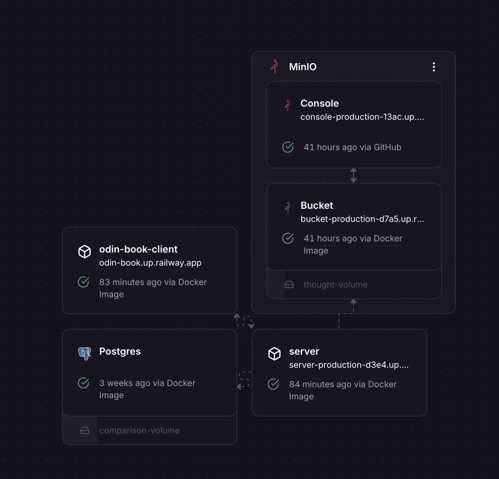

Odin-Book
A social media application inspired by Snapchat, built as part of The Odin Project's Odin-Book assignment. This project implements a simplified photo-sharing app with a focus on user interaction and media storage.
<div align="center">
  
</div>

<div align="center">
  
</div>

The screenshot above shows the application running in a Railway environment, with services like the server, client, Postgres database, and MinIO storage all operational.
Technologies Used

Frontend: React
Backend: Node.js
Database: PostgreSQL
Storage: MinIO
Containerization: Docker, Docker Compose
Deployment: Railway

Installation Instructions

Clone the repository:
```console
$ git clone <repository-url>
```

Navigate to the project directory:
```console
$ cd odin-book
```

```console
$ Start the application using Docker Compose:docker compose up
```


Ensure you have Docker and Docker Compose installed on your system. The application will be available at http://localhost:3000 for the client and http://localhost:3001 for the server.
Live Demo
Check out the live demo of the application [here](https://odin-book.up.railway.app/) 
